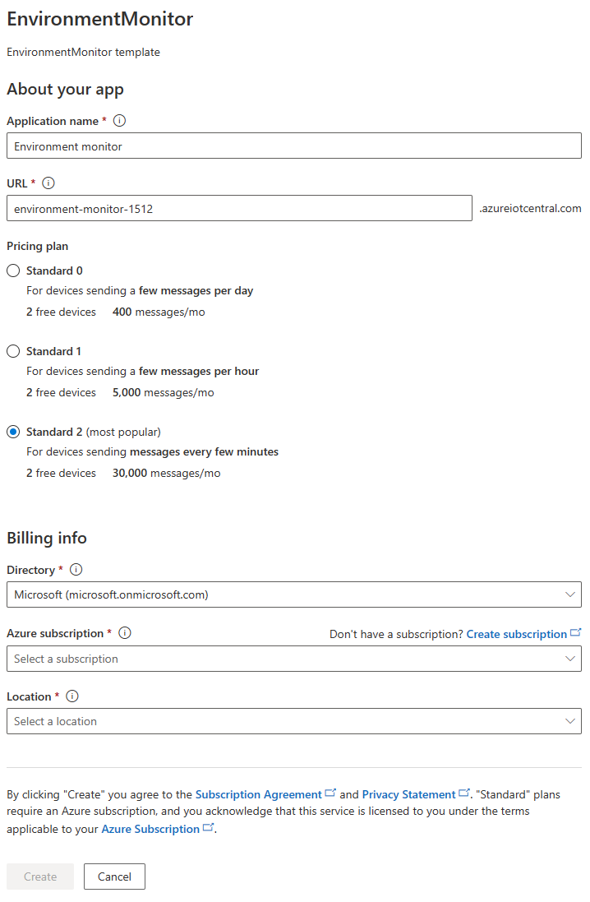
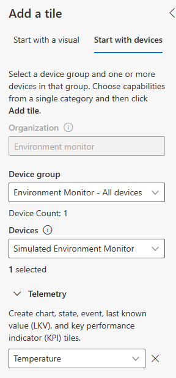

# Set up IoT Central and send simulated data

In this step you will set up Azure IoT Central and send data from a simulated device.

## IoT Central applications

IoT Central has the concept of 'Applications' or apps - each one a separate IoT application taking data from a defined set of devices, and showing that data on dashboards.

For example, if you had 2 IoT projects, one to monitor temperature across a campus, and another to track shared bicycle usage, you would create 2 separate apps, one for the temperature monitoring, one for tracking bicycles. If you later decided to track humidity and CO2 as well as temperature, you would add these to the temperature monitoring app instead of creating a new app.

In this lab you won't create an IoT Central application from scratch, instead you will use a template to create an application from an existing app template - essentially a pre-built app you can copy.

> If you want to learn more about create IoT Applications from scratch, check out the [Create an Azure IoT Central application documentation](https://docs.microsoft.com/azure/iot-central/core/quick-deploy-iot-central?WT.mc_id=academic-7372-jabenn).

### Device templates

All devices that can be managed by an IoT Central application have to use a device templates - these define the capabilities of a device, and includes the following:

* Interfaces - these define the behavior of the device, and these include the following features, called capabilities:
  * Telemetry - what data a device might send, such as a temperature reading
  * Commands - actions you can run remotely on the device, either from IoT Central or from other applications, such as telling an air conditioning system to turn on if a buildings temperature is too high, or weather reports suggest hot weather is coming.
  * Properties - these are values that can be set and read by both IoT Central and the device, and can be used for things like a temperature request for a heating/cooling system set either on a control panel on the device, or via a mobile app
* Cloud properties - these are properties managed by IoT Central for a device, and are stored in IoT Central only, and not sent to the device. For example this could be the username of the device owner
* Views - these are dashboards set up for devices to view telemetry, properties and cloud properties for an individual device, as well as send commands to that device

Device templates interfaces are immutable - that is they cannot be changed once created. You can't change or remove any capabilities (that is telemetry, commands or properties) from the interface once it has been created and published, nor can you delete an interface from a device template. This is to avoid problems where you have devices in use and sending data, and the template changes, rendering the devices useless if they cannot all be updated to send data in a new format.

You can always add new cloud properties and views, but you cannot change interfaces and their capabilities.

What you can do is version a device template - create a new version with a new version of an interface, or an additional interfaces with new capabilities, keeping the old ones in place.

In this lab, there is a pre-created device template to use to gather temperature data, and in a later part you will version this to add new telemetry values.

### Create an IoT Central application

To create an IoT Central application, follow these steps:

1. Click this link to create a new IoT Central application by using a template that already has a device template set up for an environment monitor with a temperature sensor:

    [aka.ms/iot-curriculum/env-monitor-template](https://apps.azureiotcentral.com/build/new/51f1a9a2-9444-4bd8-a370-4e08902c86df)

1. Log in with a Microsoft account. If you are planning to use an Azure subscription, log in with an account that has access to the subscription.

1. Fill in the form:

    1. Give your application a name, such as `Environment monitor`

    1. Each application needs a unique URL - this is the web site you will go to to access the IoT Central application. It defaults to a variant of the application name, but it needs to be globally unique - as in no other IoT central application can have the same URL. Try adding something unique to it, such as your name or the current date.

    1. Select a pricing plan. The tiers need an Azure subscription but you can have 2 devices for free. After that you pay per device/month - the Standard 0 (S0) tier is US$0.08 per device per month at the time of writing, the Standard 1 (S1) tier is US$0.40 and the Standard 2 (S2) tier is US$0.70. You can find the latest pricing for your region in the [Azure IoT Central pricing guide](https://azure.microsoft.com/pricing/details/iot-central/?WT.mc_id=academic-7372-jabenn)

        **The free pricing tier is no longer available, you know need to use an existing subscription, or create an Azure Free account**

        You can use an existing Azure subscription, or create an Azure Free account, https://azure.microsoft.com/en-us/free/search/. The recommended tier is Standard 2 to ensure that you can send enough messages. This will be free for this lab, as you will only be creating 2 devices.

    1. Select your Azure subscription and location closes to you.

    1. Select the **Create** button

    

The application will be provisioned, then it will be loaded.

### Navigate the IoT Central application

The IoT Central application is a full application to allow you to manage IoT devices, visualize data from those devices, manage 'device templates' - details on what data a device can send (called telemetry) or react to, set up rules and export data.

The side bar menu is used to navigate IoT Central.

* **Dashboard** - this section is for viewing and configuring dashboards. A dashboard is a configurable screen showing data from one or more devices from a device group, as well as images and text. The new application will have a single dashboard that will be configured to show temperature data for a range of devices.
* **Devices** - this section is to create and manage devices that can talk to this IoT Central application. The new application won't have any devices configured to start with.
* **Device groups** -  device groups are groups of devices, allowing you to group devices in a way that makes sense to you. The new application will have one device group configured called `All devices` containing all the devices that use the `Environment monitor` device template.
* **Rules** - rules allow you to set up actions that happen when conditions happen on selected devices, for example if a telemetry value exceeds a threshold. Actions can include sending emails, or calling a web hook. The new application won't have any rules configured.
* **Analytics** - this section allows you to do more in-depth analysis on the telemetry received from the devices. The new application won't have any analytics configured.
* **Jobs** - jobs can be set up to set properties on devices, or execute commands at specific times. The new application won't have any jobs configured.
* **Device Templates** - this section allows you to configure device templates. The new application will have a single device template - `Environment monitor` configured with a single interface that has a single telemetry value for the temperature, along with a single view to see the last 100 temperature values.
* **Data Export** - this section allows you to configure data export to either a database, or to an Azure Event Hub - essentially a large pipe to send data to other systems. The new application won't have any data export configured.
* **Administration** - this section is for administering the IoT Central application, such as deleting it, renaming it, or providing other users with access.

## Create a device

IoT Central has two types of device you can create - a physical device which you will need to configure to interact with IoT Central, and a simulated device that creates simulated values that matches the device template.

To see IoT Central in action, you can create a simulated device and see simulated temperature data on the view for the device and the dashboard.

### Create a simulated device

To create a simulated device, do the following:

1. Select **Devices** from the app menu

    

1. Select the *Environment Monitor* device template

    

    Devices have to be assigned to a device templates before they can interact with IoT Central. You can either create one directly against a device template, or create one without a template and migrate it later.

1. Select **+ New** from the top menu

    

1. Fill in the details for the device:

    1. Ensure `Environment Monitor` is selected for the *Template Type*
    1. Set the *Device Name* to `Simulated Environment Monitor`
    1. Set the *Device ID* to `simulated-environment-monitor`
    1. Set *Simulate this device* to **Yes**
    1. Select the **Create** button

    

The device will be created and will appear in the devices list.

### View telemetry from the device

You can view the telemetry from the simulated device either as a chart showing values, or by visualizing the raw data.

> It may take a few minutes for simulated telemetry data to show in the view

1. Select the device from the devices list. This will load the device and show the view that is part of the device template

1. View the chart on the *Temperature* tab. This chart is configured to show the last 100 values.

    

1. View the raw data on the *Raw data* tab. This tab shows all the values over the last 7 days that is unprocessed - that is hasn't been exported to another system.

    

### Add the device to the dashboard

The device should automatically be added to the IoT Central application dashboard.

1. Select **Dashboard** from the app menu

    

1. The dashboard should show a chart of the last 100 values from the simulated device.

    

If you don't see any data on this dashboard, you may need to add the device to it manually:

1. Select the **Edit** button from the top menu

    

1. Select the properties cog from the Temperature tile

    

1. From the *Configure Chart* panel, drop down the *Devices* list, and check the `Simulated Environment Monitor`.

    

1. Select the **Update** button

    

1. Select the **Save** button for the dashboard

    

## Next steps

In this step you set up an IoT Central application using a pre-created template, and set up a simulated device.

In the [next step](./add-pi-to-iot-central.md) you will set up a physical device in IoT Central to send temperature data.
